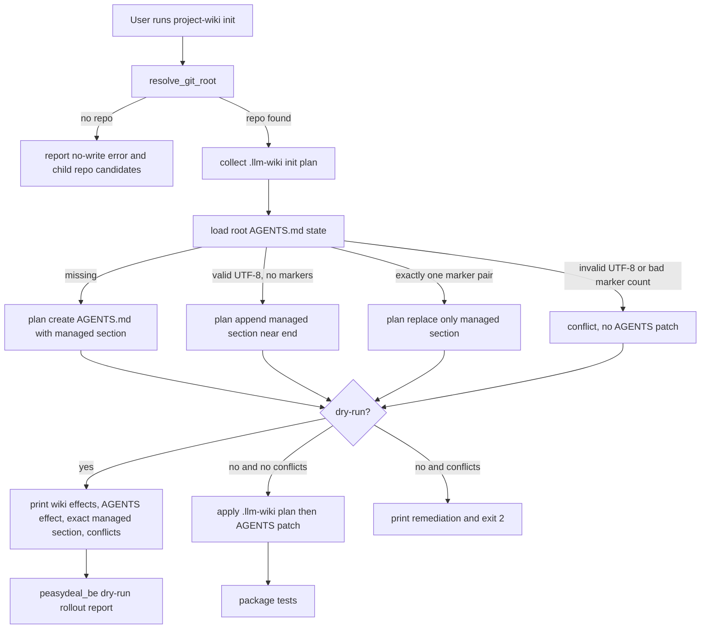

# Phase 5: Agent Instructions and Real Repo Validation - Research

**Researched:** 2026-05-14
**Domain:** Python stdlib CLI file patching, merge-safe agent instruction management, subprocess validation
**Confidence:** HIGH

<user_constraints>
## User Constraints (from CONTEXT.md)

Copied verbatim from `.planning/phases/05-agent-instructions-and-real-repo-validation/05-CONTEXT.md`. [VERIFIED: codebase read]

### Locked Decisions

## Implementation Decisions

### AGENTS Patch Timing
- **D-01:** `project-wiki init` patches root `AGENTS.md` by default when safe. The user expects this because users are likely to forget a separate `--patch-agents` option.
- **D-02:** Safe default patching creates root `AGENTS.md` when missing. If root `AGENTS.md` exists and is readable UTF-8, init inserts or updates only the Project LLM Wiki managed section.
- **D-03:** Unsafe root `AGENTS.md` states stop the AGENTS patch path and produce remediation output. Do not guess or repair damaged markers automatically.
- **D-04:** `--dry-run` reports both `.llm-wiki/` skeleton effects and root `AGENTS.md` effects. It must print the exact managed Project LLM Wiki section that would be inserted or updated; a full unified diff is not required.
- **D-05:** Provide an opt-out flag such as `--no-patch-agents` so users can intentionally initialize `.llm-wiki/` without touching root `AGENTS.md`.

### Inserted Rule Wording
- **D-06:** The root `AGENTS.md` section should be short and protocol-oriented, not a full copy of the wiki policy.
- **D-07:** Agents should read `.llm-wiki/index.md` before non-trivial architecture, debugging, product, onboarding, or cross-file implementation work.
- **D-08:** Simple typo fixes and narrow single-file edits do not require wiki lookup.
- **D-09:** Use an index-first, relevant-pages-only lookup: read `.llm-wiki/index.md`, then only task-relevant linked pages. Do not full-scan `.llm-wiki/` by default.
- **D-10:** Agents should update `.llm-wiki/` only after validated non-trivial work produces durable learning. Active task state remains in `.planning/`, issues, PRs, workflow files, or equivalent state systems.
- **D-11:** If `.llm-wiki/` disagrees with current repository files, agents must trust the current repository and report wiki drift so the stale note can be corrected later.

### Marker and Idempotency Contract
- **D-12:** The managed root `AGENTS.md` section uses HTML markers exactly shaped like `<!-- PROJECT-LLM-WIKI:START -->` and `<!-- PROJECT-LLM-WIKI:END -->`.
- **D-13:** When markers already exist, rerunning init updates only the marker-bounded managed section to the current template.
- **D-14:** Marker-external content must remain byte-for-byte unchanged, including NotebookLM, GSD, workflow, and repo-specific instruction sections.
- **D-15:** Treat invalid UTF-8, unmatched start marker, unmatched end marker, or multiple Project LLM Wiki marker pairs as conflicts. Do not patch root `AGENTS.md`; output remediation.
- **D-16:** When root `AGENTS.md` has no Project LLM Wiki markers, append the managed section near the end while preserving the final newline and existing content order.

### Validation and Rollout
- **D-17:** Fixture tests should be preservation-focused. Cover section insertion, section update, dry-run no-write behavior, marker conflicts, and a fixture containing NotebookLM/GSD/workflow sections whose marker-external content remains byte-for-byte unchanged.
- **D-18:** Validate `peasydeal_be` through dry-run reporting only. Phase 5 must not write to or commit `peasydeal_be`.
- **D-19:** The `peasydeal_be` dry-run report must include resolved git root, would-create/would-update paths, the managed root `AGENTS.md` section, and conflict status.
- **D-20:** The final rollout report uses a `PASS` / `FLAG` / `BLOCK` verdict. `PASS` means fixtures, package tests, and `peasydeal_be` dry-run pass. `FLAG` means usable with manual confirmation items. `BLOCK` means conflicts, preservation risk, or test failure.

### the agent's Discretion
The planner may decide exact helper function names, output headings, remediation wording, test fixture filenames, and whether AGENTS patching is implemented inside `init` helpers or factored into dedicated internal functions. Keep the implementation Python standard-library only unless a later phase explicitly changes that constraint.

### Deferred Ideas (OUT OF SCOPE)

## Deferred Ideas

None - discussion stayed within Phase 5 scope.
</user_constraints>

<phase_requirements>
## Phase Requirements

| ID | Description | Research Support |
|----|-------------|------------------|
| AGENT-01 | User can add a short Project LLM Wiki section to repo `AGENTS.md` without overwriting unrelated agent instructions. | Implement marker-bounded root `AGENTS.md` helpers in `project_wiki.py`; preserve marker-external bytes in fixture tests. [VERIFIED: `.planning/REQUIREMENTS.md`; `project_wiki.py`] |
| AGENT-02 | AGENTS patching preserves existing NotebookLM sections and workflow-specific guidance. | Use a byte-preservation fixture modeled on `peasydeal_be/AGENTS.md`, which has a NotebookLM section and repo-source-of-truth rules. [VERIFIED: `peasydeal_be/AGENTS.md`] |
| AGENT-03 | Inserted rules tell agents to read `.llm-wiki/index.md` before non-trivial architecture, debugging, product, or onboarding work. | Root managed section should align with existing wiki-local `AGENTS.md`, but add cross-file implementation and relevant-pages-only lookup. [VERIFIED: `assets/templates/llm-wiki/AGENTS.md`; `05-CONTEXT.md`] |
| AGENT-04 | Inserted rules state current repo code is authoritative when it disagrees with `.llm-wiki/`. | Existing wiki-local guidance and project constraints already use repo-files-as-source-of-truth wording. [VERIFIED: `assets/templates/llm-wiki/AGENTS.md`; `.planning/PROJECT.md`] |
| AGENT-05 | Inserted rules tell agents to update `.llm-wiki/` only after validated non-trivial work and never use it for task status. | Keep the root section protocol-oriented and avoid active task state; Phase 4 query/ingest already owns log/update boundaries. [VERIFIED: `04-CONTEXT.md`; `SKILL.md`] |
| TEST-06 | AGENTS patching against a fixture with an existing NotebookLM section preserves that section. | Add a subprocess tempfile test fixture with NotebookLM/GSD/workflow content and assert bytes outside markers are identical before/after. [VERIFIED: `test_project_wiki_init.py` style; `peasydeal_be/AGENTS.md`] |
| TEST-07 | Pattern is dry-run validated against `peasydeal_be` before being applied to other PeasyDeal repos. | Target repo exists at `/Users/huangchihan/develop/bbj/peasydeal/peasydeal_be`, has clean status, tracked `AGENTS.md`, no `.llm-wiki/`, and current dry-run exits 0 without writes. [VERIFIED: local commands] |
</phase_requirements>

## Summary

Phase 5 should extend the existing `project-wiki init` path rather than add a new command. The current helper already resolves the Git root, preflights init conflicts, renders dry-run create/skip sections, applies a no-overwrite init plan, and uses subprocess-level tempfile tests. [VERIFIED: `project_wiki.py:1503-1562`; `test_project_wiki_init.py:13-50`]

The core implementation problem is deterministic text surgery on root `AGENTS.md`: create when missing, insert when markers are absent, replace exactly one marker-bounded section when present, and refuse invalid UTF-8, unmatched markers, or duplicate marker pairs. Marker-external bytes are the primary invariant. [VERIFIED: `05-CONTEXT.md`; `peasydeal_be/AGENTS.md:1-49`]

`peasydeal_be` is available as the real validation target at `/Users/huangchihan/develop/bbj/peasydeal/peasydeal_be`; it currently has a tracked NotebookLM-oriented `AGENTS.md`, clean git status, and no `.llm-wiki/`. The final validation should be dry-run only and must not write or commit in that repository. [VERIFIED: local `git -C`, `ls`, `test -d`, and current dry-run commands]

**Primary recommendation:** Add AGENTS patching as a first-class part of `init`, backed by pure helper functions with byte-preservation tests, then produce a dry-run rollout report for `peasydeal_be` with `PASS` / `FLAG` / `BLOCK`. [VERIFIED: `05-CONTEXT.md`; `ROADMAP.md`]

## Project Constraints (from AGENTS.md)

- Follow GSD workflow discipline for repo edits; this research artifact is a requested GSD output path. [VERIFIED: `AGENTS.md`]
- Keep diffs small, reviewable, and reversible. [VERIFIED: `AGENTS.md`]
- Prefer deletion, existing utilities, and existing patterns before new abstractions; add dependencies only when explicitly requested. [VERIFIED: `AGENTS.md`]
- Verify with lint, typecheck, tests, or equivalent checks after changes. [VERIFIED: `AGENTS.md`]
- Commit messages, if created, must use the Lore commit protocol with decision trailers. [VERIFIED: `AGENTS.md`]
- The project-specific stack says Python standard library scripts and `unittest` are the expected implementation/test style. [VERIFIED: `AGENTS.md`; `references/testing.md:104-108`]
- No project-local `.codex/skills/` or `.agents/skills/` directories were found during discovery. [VERIFIED: `find .codex .agents -maxdepth 3 -type f -name SKILL.md`]

## Architectural Responsibility Map

| Capability | Primary Tier | Secondary Tier | Rationale |
|------------|--------------|----------------|-----------|
| Root `AGENTS.md` managed-section rendering | CLI helper / local filesystem | Templates/docs | Python owns deterministic bytes and conflict states; docs only describe the surface. [VERIFIED: `project_wiki.py`; `command-surface.md`] |
| Marker conflict detection | CLI helper / local filesystem | Tests | Conflict semantics must run before writes and be asserted through subprocess fixtures. [VERIFIED: `05-CONTEXT.md`; `test_project_wiki_init.py`] |
| Dry-run reporting | CLI helper / stdout | Rollout report | Existing dry-run already reports would-create/would-skip paths; Phase 5 adds AGENTS effects and managed section text. [VERIFIED: `project_wiki.py:1522-1540`] |
| `peasydeal_be` validation | Local validation command | Planning artifact/report | The target repo must be inspected through dry-run only; rollout verdict lives in this project, not in `peasydeal_be`. [VERIFIED: `05-CONTEXT.md`; local dry-run] |
| User-facing command contract | Reference docs and skill docs | Tests | `command-surface.md`, `testing.md`, and package tests already lock command/help documentation. [VERIFIED: `command-surface.md:116-121`; `test_project_wiki_package.py`] |

## Standard Stack

### Core

| Library / Tool | Version | Purpose | Why Standard |
|----------------|---------|---------|--------------|
| Python 3 stdlib | Python 3.14.3 local | Implement CLI parsing, UTF-8 file IO, regex marker parsing, subprocess tests, and path handling. | Existing helper imports only stdlib modules and package tests enforce an import whitelist. [VERIFIED: local `python3 --version`; `test_project_wiki_package.py`] |
| `pathlib` | stdlib in local Python | Root/path construction and filesystem checks. | Current helper uses `pathlib.Path` throughout init, lint, query, and ingest. [VERIFIED: `project_wiki.py`] |
| `argparse` | stdlib in local Python | Add `--no-patch-agents` and keep `init --dry-run`. | Current parser uses argparse and already defines `init --dry-run`. [VERIFIED: `project_wiki.py:1565-1595`] |
| `re` | stdlib in local Python | Count exact managed markers and detect invalid duplicate/unmatched marker states. | Current helper already uses regex for deterministic markdown and lint patterns. [VERIFIED: `project_wiki.py`] |
| `unittest` | stdlib in local Python | Fixture tests for insert/update/conflict/dry-run/preservation behavior. | Current tests use `unittest`, `tempfile`, `subprocess`, and `sys`. [VERIFIED: `test_project_wiki_init.py:1-5`] |
| Git | Apple Git 2.50.1 local | Resolve git root and validate real target repo status. | Existing helper shells to `git rev-parse --show-toplevel`; target validation relies on `git -C ... status --short`. [VERIFIED: local `git --version`; `project_wiki.py:111-122`] |

### Supporting

| Library / Tool | Version | Purpose | When to Use |
|----------------|---------|---------|-------------|
| `textwrap` | stdlib in local Python | Keep managed section template readable in code if not stored as an asset. | Use for dedented multi-line section constants. [VERIFIED: current import whitelist includes `textwrap`] |
| Markdown template text | repo-owned | Root managed `AGENTS.md` section body. | Use a constant or a small asset; tests should assert exact markers and required rules. [VERIFIED: `05-CONTEXT.md`; `assets/templates/llm-wiki/AGENTS.md`] |
| `rg` | local search tool | Developer inspection only. | Useful for verification and docs drift checks; do not make it a runtime dependency. [VERIFIED: AGENTS.md preference; current helper has no `rg` import] |

### Alternatives Considered

| Instead of | Could Use | Tradeoff |
|------------|-----------|----------|
| Python stdlib text patching | Third-party markdown parser | Rejected for v1 because root `AGENTS.md` only needs marker-bounded byte-preserving replacement, and project constraints prohibit new dependencies without explicit need. [VERIFIED: `AGENTS.md`; `05-CONTEXT.md`] |
| Exact managed section in `project_wiki.py` | Separate template asset | Either is acceptable; a helper constant is simpler for a short root section, while an asset is easier to inspect. Planner may choose. [VERIFIED: `05-CONTEXT.md` discretion] |
| Unified diff dry-run | Exact managed section printout | Rejected by locked decision: no unified diff required; dry-run must print exact managed section. [VERIFIED: `05-CONTEXT.md` D-04] |
| Automatic marker repair | Manual remediation output | Rejected by locked decision: invalid UTF-8, unmatched markers, and duplicate pairs are conflicts. [VERIFIED: `05-CONTEXT.md` D-03, D-15] |

**Installation:**

```bash
# No new packages. Use the existing local runtime:
python3 -m unittest discover -s skills/project-llm-wiki/tests
```

**Version verification:** No npm or PyPI package versions are recommended for Phase 5. Local versions verified: Python 3.14.3 and Apple Git 2.50.1. [VERIFIED: local commands]

## Architecture Patterns

### System Architecture Diagram



### Recommended Project Structure

```text
skills/project-llm-wiki/
├── scripts/project_wiki.py                 # init flow, AGENTS patch helpers, output
├── tests/test_project_wiki_init.py         # subprocess init and AGENTS preservation tests
├── tests/test_project_wiki_package.py      # help/docs/import whitelist assertions
├── references/command-surface.md           # user command contract
├── references/testing.md                   # validation contract and commands
└── assets/templates/llm-wiki/AGENTS.md     # wiki-local guidance, not root managed section

.planning/phases/05-agent-instructions-and-real-repo-validation/
├── 05-RESEARCH.md
└── rollout-report.md or 05-ROLLOUT-REPORT.md # final PASS/FLAG/BLOCK report, planner choice
```

### Pattern 1: Pure Plan Then Apply

**What:** Compute `.llm-wiki/` paths and root `AGENTS.md` patch effects before writing; only apply when conflicts are absent. [VERIFIED: existing init flow in `project_wiki.py:1516-1556`]

**When to use:** Use for all Phase 5 writes so dry-run and real run share the same planning logic. [VERIFIED: `05-CONTEXT.md` D-04, D-17]

**Example:**

```python
# Source: existing project_wiki.py init pattern, adapted for Phase 5.
conflicts = find_init_conflicts(git_root)
agents_plan = build_agents_patch_plan(git_root, patch_agents=not args.no_patch_agents)
if args.dry_run:
    print_path_section("Would create paths:", would_create)
    print_agents_plan(agents_plan)
    return 2 if conflicts or agents_plan.conflict else 0
if conflicts or agents_plan.conflict:
    print_text_section("Conflicts:", [*conflicts, *agents_plan.conflicts])
    return 2
apply_init_plan(git_root, file_contents)
apply_agents_patch_plan(agents_plan)
```

### Pattern 2: Byte-Preserving Managed Section Replacement

**What:** Parse root `AGENTS.md` bytes as UTF-8 only after reading bytes, count exact start/end markers, and replace only the inclusive marker-bounded section when exactly one valid pair exists. [VERIFIED: `05-CONTEXT.md` D-12 through D-15]

**When to use:** Use for existing root `AGENTS.md` files; tests should compare pre/post bytes outside the managed span. [VERIFIED: `05-CONTEXT.md` D-14, D-17]

**Example:**

```python
# Source: Phase 5 locked marker contract.
START = "<!-- PROJECT-LLM-WIKI:START -->"
END = "<!-- PROJECT-LLM-WIKI:END -->"

def replace_managed_section(text: str, section: str) -> tuple[str | None, str | None]:
    start_count = text.count(START)
    end_count = text.count(END)
    if start_count != 1 or end_count != 1:
        return None, "root AGENTS.md has invalid Project LLM Wiki markers"
    start = text.index(START)
    end = text.index(END, start) + len(END)
    if text.find(START, start + len(START), end) != -1:
        return None, "root AGENTS.md has nested Project LLM Wiki markers"
    return text[:start] + section + text[end:], None
```

### Pattern 3: Real Repo Dry-Run Report

**What:** Run the implemented helper from `/Users/huangchihan/develop/bbj/peasydeal/peasydeal_be` with `init --dry-run`, capture stdout/stderr, then record resolved root, would-create/would-update paths, managed section, conflict status, and git status before/after. [VERIFIED: `05-CONTEXT.md` D-18 through D-20; local dry-run]

**When to use:** Plan 05-02; this is validation/reporting, not a write to the target repository. [VERIFIED: `ROADMAP.md` Phase 5 Plan 05-02]

### Anti-Patterns to Avoid

- **Editing outside marker bounds:** This violates AGENT-01/AGENT-02 because NotebookLM, GSD, workflow, and repo-specific sections must remain unchanged. [VERIFIED: `05-CONTEXT.md`; `peasydeal_be/AGENTS.md`]
- **Patching damaged markers automatically:** Locked decisions require conflict output, not repair. [VERIFIED: `05-CONTEXT.md` D-03, D-15]
- **Making AGENTS patching opt-in by default:** User explicitly rejected easy-to-forget `--patch-agents`; use default patching plus `--no-patch-agents`. [VERIFIED: `05-CONTEXT.md` D-01, D-05]
- **Scanning all `.llm-wiki/` pages from root AGENTS guidance:** Inserted rules require index-first and relevant-pages-only lookup. [VERIFIED: `05-CONTEXT.md` D-09]
- **Writing to `peasydeal_be` during validation:** Phase 5 validation is dry-run only. [VERIFIED: `05-CONTEXT.md` D-18]

## Don't Hand-Roll

| Problem | Don't Build | Use Instead | Why |
|---------|-------------|-------------|-----|
| Git root discovery | Parent-directory walking | Existing `resolve_git_root` using `git rev-parse --show-toplevel` | Already implemented and validated for subdirectories/parent workspace cases. [VERIFIED: `project_wiki.py:111-122`; `test_project_wiki_init.py:52-100`] |
| CLI parsing | Custom `sys.argv` parsing | Existing `argparse` parser | Existing help/package tests depend on argparse help output. [VERIFIED: `project_wiki.py:1565-1595`; `test_project_wiki_package.py`] |
| Diff generation | Custom unified diff renderer | Exact managed section printout | Locked decision says unified diff is not required. [VERIFIED: `05-CONTEXT.md` D-04] |
| Markdown AST rewriting | Markdown parser | Exact marker counting and string replacement | The managed section contract is marker-bound, not semantic markdown transformation. [VERIFIED: `05-CONTEXT.md` D-12 through D-16] |
| Real-repo mutation validation | Temporary branch/commit in `peasydeal_be` | Dry-run command plus report artifact in this repo | Locked decision prohibits writing or committing the target repo. [VERIFIED: `05-CONTEXT.md` D-18] |

**Key insight:** The hard part is not Markdown formatting; it is preserving every byte outside the managed marker span while producing enough dry-run evidence to trust rollout. [VERIFIED: `05-CONTEXT.md`; `peasydeal_be/AGENTS.md`]

## Common Pitfalls

### Pitfall 1: Marker-External Whitespace Drift

**What goes wrong:** A helper normalizes line endings, final newlines, or trailing whitespace outside the managed section. [VERIFIED: `05-CONTEXT.md` D-14]

**Why it happens:** Implementations often call `splitlines()` and rejoin whole files, which rewrites more than the target span. [ASSUMED]

**How to avoid:** Read root `AGENTS.md` as bytes, decode UTF-8 for marker calculations, and preserve original prefix/suffix strings exactly. [VERIFIED: `05-CONTEXT.md` D-14, D-15]

**Warning signs:** Preservation tests compare normalized text instead of bytes. [VERIFIED: `05-CONTEXT.md` D-17]

### Pitfall 2: Dry-Run and Apply Logic Diverge

**What goes wrong:** Dry-run reports one managed section but real apply writes another section or misses a conflict. [VERIFIED: `05-CONTEXT.md` D-04, D-17]

**Why it happens:** Dry-run builds output separately from the apply path. [ASSUMED]

**How to avoid:** Build one `AgentsPatchPlan` data shape and use it for dry-run rendering and apply. [VERIFIED: existing init plan shape in `project_wiki.py:1516-1556`]

**Warning signs:** Tests assert dry-run strings only, with no apply/idempotency counterpart. [VERIFIED: `test_project_wiki_init.py` existing dry-run/apply pairing]

### Pitfall 3: `peasydeal_be` Path Assumption

**What goes wrong:** Planner uses `/Users/huangchihan/develop/bbj/peasydeal_be`, which does not exist in this workspace. [VERIFIED: local `test -d` and `find` commands]

**Why it happens:** The phase name references `peasydeal_be` without the parent `peasydeal/` folder. [VERIFIED: local directory listing]

**How to avoid:** Use `/Users/huangchihan/develop/bbj/peasydeal/peasydeal_be`, or rediscover with `find /Users/huangchihan/develop/bbj -maxdepth 4 -type d -name peasydeal_be`. [VERIFIED: local `find` command]

**Warning signs:** `git -C ... rev-parse` fails before validation starts. [VERIFIED: local failed command against the shorter path]

### Pitfall 4: Confusing Wiki-Local and Root AGENTS Guidance

**What goes wrong:** Root `AGENTS.md` receives the full wiki-local policy text, making startup instructions noisy and duplicative. [VERIFIED: `05-CONTEXT.md` D-06; `assets/templates/llm-wiki/AGENTS.md`]

**Why it happens:** The existing `.llm-wiki/AGENTS.md` template is close to the desired content but is not scoped as root repo guidance. [VERIFIED: `assets/templates/llm-wiki/AGENTS.md`]

**How to avoid:** Use the template as wording input only; root managed section should be short and protocol-oriented. [VERIFIED: `05-CONTEXT.md` D-06]

### Pitfall 5: Treating Heuristic Safety Checks as Web-App Security

**What goes wrong:** Planner over-scopes auth/session/access-control work for a local CLI patching phase. [VERIFIED: phase requirements AGENT-01..TEST-07]

**Why it happens:** GSD security section uses broad ASVS categories by default. [VERIFIED: `.planning/config.json`; OWASP ASVS page]

**How to avoid:** Limit security tasks to local file integrity, path/root confinement, UTF-8 validation, and unsafe content boundaries already present in the package. [VERIFIED: `project_wiki.py`; `references/testing.md:104-108`]

## Code Examples

### Root Managed Section Template Shape

```text
<!-- PROJECT-LLM-WIKI:START -->
## Project LLM Wiki

Before non-trivial architecture, debugging, product, onboarding, or cross-file implementation work, read `.llm-wiki/index.md` first, then only task-relevant linked pages.

For simple typo fixes and narrow single-file edits, wiki lookup is not required.

Current repository files are authoritative when they disagree with `.llm-wiki/`; report wiki drift when found.

Update `.llm-wiki/` only after validated non-trivial work produces durable learning. Do not use `.llm-wiki/` for active task status.
<!-- PROJECT-LLM-WIKI:END -->
```

Source: locked Phase 5 wording decisions and existing wiki-local guidance. [VERIFIED: `05-CONTEXT.md` D-06 through D-11; `assets/templates/llm-wiki/AGENTS.md`]

### Byte Preservation Test Pattern

```python
# Source: existing unittest/subprocess fixture style in test_project_wiki_init.py.
before = agents_path.read_bytes()
result = self.run_helper(repo, "init")
after = agents_path.read_bytes()

start = after.index(b"<!-- PROJECT-LLM-WIKI:START -->")
end = after.index(b"<!-- PROJECT-LLM-WIKI:END -->") + len(b"<!-- PROJECT-LLM-WIKI:END -->")
self.assertEqual(before, after[:start] + after[end:])
self.assertIn(b"## NotebookLM Second Brain", after)
```

### Dry-Run No-Write Validation Pattern

```python
# Source: existing dry-run no-write fixture style.
before = agents_path.read_bytes() if agents_path.exists() else None
result = self.run_helper(repo, "init", "--dry-run")
self.assertEqual(0, result.returncode, result.stdout + result.stderr)
self.assertIn("Managed AGENTS.md section:", result.stdout)
if before is None:
    self.assertFalse(agents_path.exists())
else:
    self.assertEqual(before, agents_path.read_bytes())
```

## State of the Art

| Old Approach | Current Phase 5 Approach | When Changed | Impact |
|--------------|--------------------------|--------------|--------|
| AGENTS integration deferred | Default `init` patches root `AGENTS.md` when safe, with `--no-patch-agents` opt-out | Phase 5 context, 2026-05-14 | Planner should update command docs and helper help; no separate required `--patch-agents`. [VERIFIED: `05-CONTEXT.md`] |
| Wiki-local `AGENTS.md` only | Root repo `AGENTS.md` gets a short retrieval/update protocol | Phase 5 context, 2026-05-14 | Future agents can discover `.llm-wiki/` without reading wiki files first. [VERIFIED: `05-CONTEXT.md`; `assets/templates/llm-wiki/AGENTS.md`] |
| Clean-repo validation only | Real `peasydeal_be` dry-run report required before broader rollout | Roadmap Phase 5 | Planner must include a validation/report task after tests. [VERIFIED: `ROADMAP.md`; local target repo checks] |

**Deprecated/outdated:**
- `command-surface.md` still lists AGENTS integration and real repo validation as deferred Phase 5 behavior; Phase 5 should update this after implementation. [VERIFIED: `command-surface.md:116-121`]
- `testing.md` has Phase 2-4 validation contracts but no Phase 5 AGENTS validation section; Phase 5 should add it. [VERIFIED: `testing.md:1-110`]

## Assumptions Log

| # | Claim | Section | Risk if Wrong |
|---|-------|---------|---------------|
| A1 | Implementations often cause whitespace drift when using `splitlines()` and whole-file rejoin. | Common Pitfalls | Low; tests still protect the real invariant even if the mechanism differs. |
| A2 | Dry-run/apply divergence usually comes from separate code paths. | Common Pitfalls | Low; recommendation to share a plan object remains valid either way. |

## Open Questions

1. **Where should the final rollout report live?**
   - What we know: Phase 5 requires a final PASS/FLAG/BLOCK report; no exact path is locked. [VERIFIED: `05-CONTEXT.md` D-20]
   - What's unclear: Whether planner should create `05-ROLLOUT-REPORT.md`, update `05-VERIFICATION.md`, or use another repo convention. [VERIFIED: current phase directory contents]
   - Recommendation: Use `.planning/phases/05-agent-instructions-and-real-repo-validation/05-ROLLOUT-REPORT.md` so the dry-run evidence remains phase-local. [ASSUMED]

2. **Should the root managed section be a Python constant or asset file?**
   - What we know: Planner has discretion over helper names and implementation factoring; root section should be short. [VERIFIED: `05-CONTEXT.md`]
   - What's unclear: Whether inspectability or implementation simplicity matters more.
   - Recommendation: Use a Python constant first; if docs/tests need a separately inspectable artifact, move it to a template asset in the same plan. [ASSUMED]

## Environment Availability

| Dependency | Required By | Available | Version | Fallback |
|------------|-------------|-----------|---------|----------|
| Python 3 | Helper and tests | yes | 3.14.3 at `/opt/homebrew/bin/python3` | None needed. [VERIFIED: local commands] |
| Git | Git-root detection and target validation | yes | Apple Git 2.50.1 at `/usr/bin/git` | None; existing helper requires Git. [VERIFIED: local commands; `project_wiki.py`] |
| `peasydeal_be` repo | TEST-07 dry-run validation | yes | Git root `/Users/huangchihan/develop/bbj/peasydeal/peasydeal_be` | Rediscover with `find` if moved. [VERIFIED: local commands] |
| `peasydeal_be/AGENTS.md` | NotebookLM preservation validation | yes | tracked file, 2691 bytes at read time | If missing later, Phase 5 becomes FLAG or BLOCK depending on dry-run conflict. [VERIFIED: local `ls`, `git ls-files`] |
| `.llm-wiki/` in `peasydeal_be` | Dry-run would-create baseline | absent | - | Expected for first validation; dry-run should report would-create paths. [VERIFIED: local `test -d`; current dry-run] |

**Missing dependencies with no fallback:**
- None. [VERIFIED: environment probes]

**Missing dependencies with fallback:**
- No external package dependencies are needed. [VERIFIED: `references/testing.md:104-108`; import whitelist test]

## Validation Architecture

### Test Framework

| Property | Value |
|----------|-------|
| Framework | Python stdlib `unittest` on Python 3.14.3. [VERIFIED: local command; test files] |
| Config file | none; tests run through `unittest discover`. [VERIFIED: `references/testing.md:5-19`] |
| Quick run command | `python3 -m unittest discover -s skills/project-llm-wiki/tests -p test_project_wiki_init.py` |
| Full suite command | `python3 -m unittest discover -s skills/project-llm-wiki/tests` |

### Phase Requirements -> Test Map

| Req ID | Behavior | Test Type | Automated Command | File Exists? |
|--------|----------|-----------|-------------------|--------------|
| AGENT-01 | Insert short managed section without overwriting unrelated root `AGENTS.md` content | unit/subprocess | `python3 -m unittest discover -s skills/project-llm-wiki/tests -p test_project_wiki_init.py` | yes, extend `test_project_wiki_init.py` |
| AGENT-02 | Preserve existing NotebookLM/workflow guidance outside markers | unit/subprocess | `python3 -m unittest discover -s skills/project-llm-wiki/tests -p test_project_wiki_init.py` | yes, add fixture test |
| AGENT-03 | Inserted section says read `.llm-wiki/index.md` before non-trivial architecture/debugging/product/onboarding work | unit/subprocess | `python3 -m unittest discover -s skills/project-llm-wiki/tests -p test_project_wiki_init.py` | yes, add exact text assertion |
| AGENT-04 | Inserted section says repo code/files are authoritative over wiki notes | unit/subprocess | `python3 -m unittest discover -s skills/project-llm-wiki/tests -p test_project_wiki_init.py` | yes, add exact text assertion |
| AGENT-05 | Inserted section says update wiki only after validated durable learning and never for task status | unit/subprocess | `python3 -m unittest discover -s skills/project-llm-wiki/tests -p test_project_wiki_init.py` | yes, add exact text assertion |
| TEST-06 | NotebookLM fixture remains byte-preserved outside managed markers | unit/subprocess | `python3 -m unittest discover -s skills/project-llm-wiki/tests -p test_project_wiki_init.py` | yes, add fixture test |
| TEST-07 | `peasydeal_be` dry-run report succeeds without writes | smoke/report | `python3 skills/project-llm-wiki/scripts/project_wiki.py init --dry-run` from target repo | no report file yet; Wave 0 gap |

### Sampling Rate

- **Per task commit:** `python3 -m unittest discover -s skills/project-llm-wiki/tests -p test_project_wiki_init.py` [VERIFIED: local init suite ran 14 tests OK before Phase 5 edits]
- **Per wave merge:** `python3 -m unittest discover -s skills/project-llm-wiki/tests` [VERIFIED: `references/testing.md`]
- **Phase gate:** Full suite green plus `peasydeal_be` dry-run report with unchanged target git status. [VERIFIED: `05-CONTEXT.md` D-18 through D-20]

### Wave 0 Gaps

- [ ] Add AGENTS patch fixture tests to `skills/project-llm-wiki/tests/test_project_wiki_init.py` for insertion, update, `--dry-run`, `--no-patch-agents`, invalid UTF-8, unmatched markers, duplicate marker pairs, missing root `AGENTS.md`, and byte preservation around NotebookLM/GSD/workflow content. [VERIFIED: `05-CONTEXT.md` D-15, D-17]
- [ ] Add package/help/doc assertions in `skills/project-llm-wiki/tests/test_project_wiki_package.py` for `--no-patch-agents`, completed AGENTS integration docs, and Phase 5 testing docs. [VERIFIED: `test_project_wiki_package.py`; `command-surface.md:116-121`]
- [ ] Create a phase-local rollout report file path for the `peasydeal_be` dry-run evidence. [ASSUMED: planner path choice]

## Security Domain

OWASP ASVS is a basis for web application security verification, and the current stable ASVS version is 5.0.0. This phase is a local CLI/file-patching phase, so only local input validation and file integrity concerns materially apply. [CITED: https://owasp.org/www-project-application-security-verification-standard/]

### Applicable ASVS Categories

| ASVS Category | Applies | Standard Control |
|---------------|---------|------------------|
| V2 Authentication | no | No authentication surface in this local CLI change. [VERIFIED: phase requirements] |
| V3 Session Management | no | No session/cookie/token handling in this local CLI change. [VERIFIED: phase requirements] |
| V4 Access Control | partial | Respect repository boundary and do not write outside intended git root; do not write target `peasydeal_be` during validation. [VERIFIED: `project_wiki.py`; `05-CONTEXT.md`] |
| V5 Input Validation | yes | Validate CLI flags, UTF-8 decoding, marker counts/order, root-confined paths, and conflict states before writes. [VERIFIED: `project_wiki.py`; `05-CONTEXT.md`] |
| V6 Cryptography | no | No cryptographic operations or key management in scope. [VERIFIED: phase requirements] |

### Known Threat Patterns for Local CLI File Patching

| Pattern | STRIDE | Standard Mitigation |
|---------|--------|---------------------|
| Symlink/path escape from repo root | Tampering | Reuse root-confined path checks and preflight conflicts before writes. [VERIFIED: `project_wiki.py`; init tests] |
| Root `AGENTS.md` instruction clobbering | Tampering | Marker-bounded replacement and byte-preservation tests around external content. [VERIFIED: `05-CONTEXT.md`] |
| Malformed marker ambiguity | Tampering / Denial of Service | Treat unmatched/duplicate marker pairs as conflicts with remediation output. [VERIFIED: `05-CONTEXT.md` D-15] |
| Invalid UTF-8 root instructions | Denial of Service | Refuse AGENTS patch path and report remediation; do not guess encoding. [VERIFIED: `05-CONTEXT.md` D-15] |
| Secret leakage into wiki or instructions | Information Disclosure | Keep inserted rules short and do not store secrets; existing lint/ingest policies already reject secret-looking wiki content. [VERIFIED: `assets/templates/llm-wiki/AGENTS.md`; `project_wiki.py`] |
| Accidental writes to validation target | Tampering | Use dry-run only, verify target git status before/after, and store report in this repo. [VERIFIED: `05-CONTEXT.md` D-18; local status check] |

## Sources

### Primary (HIGH confidence)

- `.planning/phases/05-agent-instructions-and-real-repo-validation/05-CONTEXT.md` - locked Phase 5 decisions, marker contract, dry-run/report requirements. [VERIFIED: codebase read]
- `.planning/REQUIREMENTS.md` - AGENT-01 through AGENT-05 and TEST-06 through TEST-07. [VERIFIED: codebase read]
- `.planning/ROADMAP.md` - Phase 5 goal, plans, and success criteria. [VERIFIED: codebase read]
- `.planning/STATE.md` - project history and prior decisions. [VERIFIED: codebase read]
- `.planning/PROJECT.md` - project constraints, source-of-truth boundary, target repo rollout context. [VERIFIED: codebase read]
- `skills/project-llm-wiki/scripts/project_wiki.py` - existing helper implementation and init flow. [VERIFIED: codebase read]
- `skills/project-llm-wiki/tests/test_project_wiki_init.py` - existing subprocess tempfile init fixture style. [VERIFIED: codebase read]
- `skills/project-llm-wiki/tests/test_project_wiki_package.py` - import whitelist and docs/help test pattern. [VERIFIED: codebase read]
- `skills/project-llm-wiki/references/command-surface.md` - current command docs and deferred Phase 5 note. [VERIFIED: codebase read]
- `skills/project-llm-wiki/references/testing.md` - test commands, validation contracts, no-dependency rule. [VERIFIED: codebase read]
- `skills/project-llm-wiki/assets/templates/llm-wiki/AGENTS.md` - existing wiki-local guidance. [VERIFIED: codebase read]
- `/Users/huangchihan/develop/bbj/peasydeal/peasydeal_be/AGENTS.md` - real target NotebookLM section and preservation fixture model. [VERIFIED: local file read]
- Local commands: `python3 --version`, `git --version`, target `git status --short`, target current `init --dry-run`, and `python3 -m unittest discover -s skills/project-llm-wiki/tests -p test_project_wiki_init.py`. [VERIFIED: local command output]

### Secondary (MEDIUM confidence)

- OWASP Application Security Verification Standard project page - ASVS purpose and current stable 5.0.0. [CITED: https://owasp.org/www-project-application-security-verification-standard/]

### Tertiary (LOW confidence)

- None.

## Metadata

**Confidence breakdown:**
- Standard stack: HIGH - phase uses existing Python stdlib helper/tests; local versions and import whitelist were verified. [VERIFIED: local commands; codebase]
- Architecture: HIGH - implementation fits existing init flow and locked Phase 5 decisions. [VERIFIED: `project_wiki.py`; `05-CONTEXT.md`]
- Pitfalls: MEDIUM - preservation and conflict pitfalls are directly source-backed; two implementation-cause notes are assumptions and logged. [VERIFIED: `05-CONTEXT.md`; ASSUMED items A1-A2]
- Real repo target: HIGH - target path, clean status, tracked AGENTS, no `.llm-wiki/`, and current dry-run were verified without writes. [VERIFIED: local commands]

**Research date:** 2026-05-14
**Valid until:** 2026-06-13 for local codebase findings; 2026-05-21 for external security-standard version reference.
